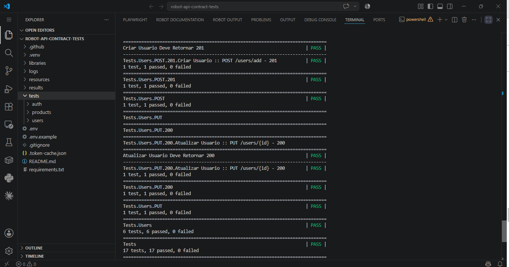
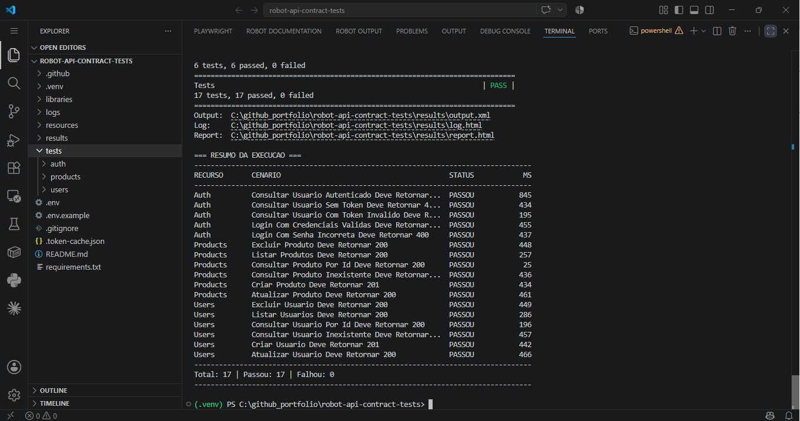
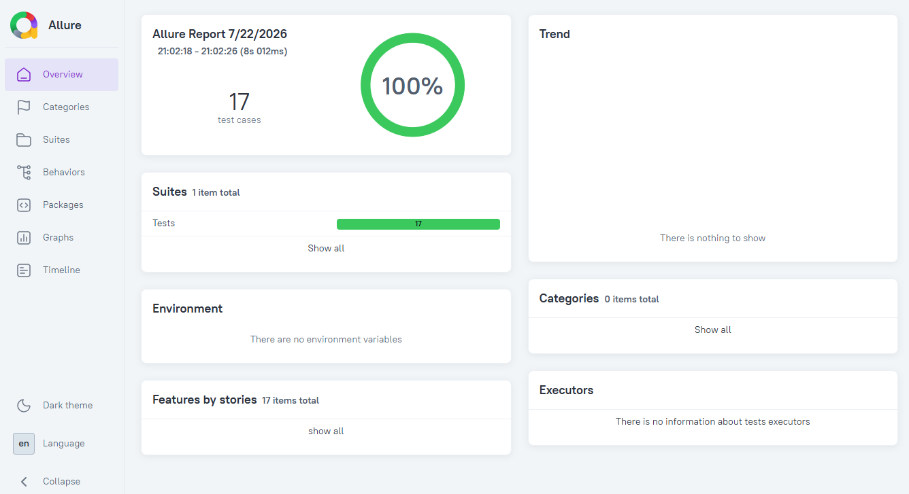
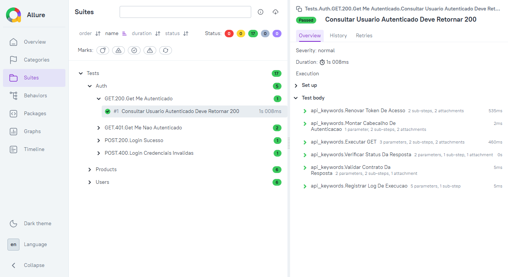
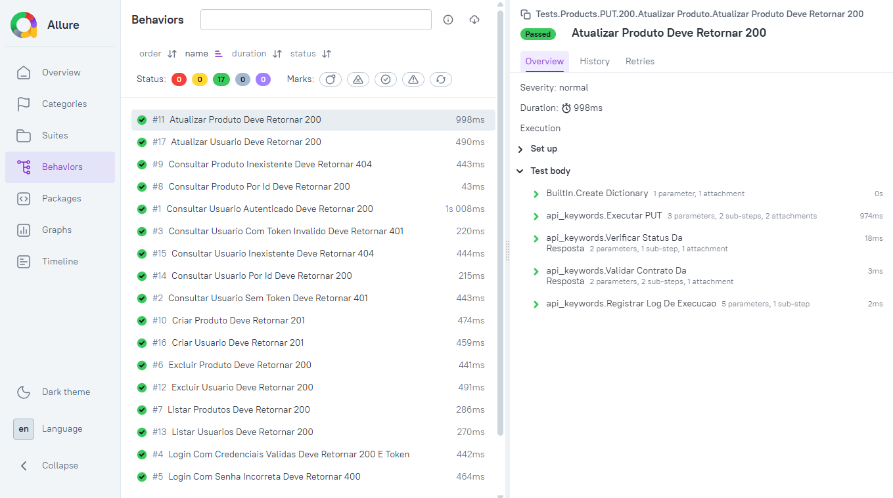
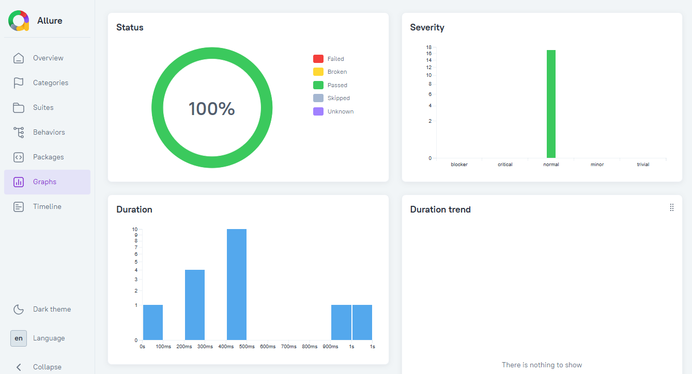

# robot-api-contract-tests

Testes de contrato de API REST pública (DummyJSON), com **Robot Framework + RequestsLibrary**.


---

## 🚀 Como instalar e executar

Guia completo para quem está clonando este repositório pela primeira vez — não assume nenhum conhecimento prévio do projeto. Siga os passos **na ordem**, um comando de cada vez.

### Pré-requisitos

- **Python 3.10 ou superior** instalado ([python.org/downloads](https://www.python.org/downloads/)). Verifique com:
  ```bash
  python --version
  ```
- **Git** instalado (para clonar o repositório).

### 1. Clone o repositório

```bash
git clone https://github.com/moiseschiaretto/robot-api-contract-tests.git
cd robot-api-contract-tests
```

### 2. Crie o ambiente virtual

Comando **idêntico em Windows, Linux e Mac**:

```bash
python -m venv .venv
```

Isso cria a pasta `.venv/` dentro do projeto. Nada é ativado ainda — é só o próximo passo.

### 3. Ative o ambiente virtual

⚠️ **Passo mais importante e mais fácil de pular sem perceber.** Sem ativar, os pacotes são instalados no Python global do seu sistema, não no projeto — isso ainda "funciona" (por isso o erro passa despercebido), mas anula o isolamento entre projetos.

**Windows (PowerShell):**
```powershell
.\.venv\Scripts\Activate.ps1
```

Se aparecer um erro de política de execução de scripts, rode antes:
```powershell
Set-ExecutionPolicy -Scope Process -ExecutionPolicy Bypass
```

**Linux / Mac:**
```bash
source .venv/bin/activate
```

**✅ Verificação obrigatória:** o início da linha de comando deve passar a mostrar `(.venv)`:
```
(.venv) PS C:\algum-caminho\robot-api-contract-tests>
```
Se não aparecer `(.venv)`, a ativação não funcionou — repita antes de continuar. Esse texto `(.venv) PS ...` é gerado automaticamente pelo terminal; não é um comando para digitar.

### 4. Instale as dependências

```bash
pip install -r requirements.txt
```

**✅ Verificação obrigatória:** no texto exibido, confirme que os caminhos de instalação apontam para dentro da pasta do projeto (ex: `...\robot-api-contract-tests\.venv\Lib\site-packages\...`). Se aparecer algo como `C:\Users\SeuUsuario\AppData\...`, o passo 3 foi pulado — volte lá.

### 5. Configure o ambiente

```bash
cp .env.example .env
```
(No Windows PowerShell: `copy .env.example .env`)

### 6. Execute os testes

```bash
robot --outputdir results --listener resources/listeners/SummaryListener.py tests/
```

Ao final, você verá:
1. O console nativo do Robot Framework, mostrando a árvore de suites (recurso → método → status).
2. Um **Resumo da Execução** impresso logo depois, com uma tabela consolidada (recurso, cenário, status, tempo em ms).

Os relatórios ficam em `results/` (não na raiz do projeto):
- `results/report.html` — resumo executivo
- `results/log.html` — detalhe completo de cada passo
- `results/output.xml` — dados brutos

> ⚠️ Sempre use `--outputdir results` como no comando acima. Se esse parâmetro for omitido, o Robot Framework grava `report.html`, `log.html` e `output.xml` soltos na raiz do projeto.

---

## 📊 Relatório Allure (opcional)

O relatório nativo do Robot Framework (`results/report.html`) já é suficiente para uso diário. O Allure é uma camada **opcional**, com uma interface mais rica (gráficos, histórico, categorização por severidade) — o mesmo padrão já usado nos outros projetos do portfólio (`java-api-rest-assured-contract-tests`, `mobile-python-appium-yodapp`), para manter consistência visual entre eles.

### Passo 1 — Instalar a CLI do Allure (feito uma única vez)

A CLI do Allure é um programa **separado** do pacote Python `allure-robotframework` (esse já vem no `requirements.txt` e já foi instalado no passo 4 lá em cima). A CLI é quem efetivamente **abre** o relatório no navegador — sem ela, os dados são gerados mas não há como visualizá-los. Ela depende de **Java (JRE 8+)** instalado na máquina.

> ⚠️ Escolha **apenas um** dos caminhos abaixo, conforme seu sistema operacional — Scoop **ou** Chocolatey **ou** Homebrew. Não é necessário instalar mais de um gerenciador de pacotes.

**Windows, opção 1 (via [Scoop](https://scoop.sh/)):**

Se você ainda não tem o Scoop instalado, instale-o primeiro:
```powershell
Set-ExecutionPolicy RemoteSigned -Scope CurrentUser
irm get.scoop.sh | iex
```
**Feche o terminal/editor por completo e abra de novo** (o Windows só reconhece o novo comando `scoop` em uma sessão nova — inclusive se você usa VS Code, feche o programa inteiro, não só a aba do terminal). Depois, instale o Allure:
```powershell
scoop install allure
```

**Windows, opção 2 (via [Chocolatey](https://chocolatey.org/)):**

Se você ainda não tem o Chocolatey instalado, instale-o primeiro (PowerShell como Administrador):
```powershell
Set-ExecutionPolicy Bypass -Scope Process -Force
[System.Net.ServicePointManager]::SecurityProtocol = [System.Net.ServicePointManager]::SecurityProtocol -bor 3072
iex ((New-Object System.Net.WebClient).DownloadString('https://community.chocolatey.org/install.ps1'))
```
Feche e abra o terminal/editor por completo, depois instale o Allure:
```powershell
choco install allure
```

**Mac (via [Homebrew](https://brew.sh/)):**

Se você ainda não tem o Homebrew instalado, instale-o primeiro:
```bash
/bin/bash -c "$(curl -fsSL https://raw.githubusercontent.com/Homebrew/install/HEAD/install.sh)"
```
Depois instale o Allure:
```bash
brew install allure
```

**Linux:** siga as instruções oficiais em [allurereport.org/docs/install](https://allurereport.org/docs/install/).

**✅ Verificação obrigatória** — confirme que a CLI foi reconhecida antes de seguir:
```bash
allure --version
```
Se aparecer um número de versão (ex: `2.43.0`), está pronto — não repita a instalação depois disso, mesmo em execuções futuras.

### Passo 2 — Gerar os dados do relatório

```bash
robot --outputdir results --listener resources/listeners/SummaryListener.py --listener allure_robotframework:results/allure-results tests/
```

Esse é o mesmo comando de execução dos testes (passo 6 no início deste README), só que com um segundo `--listener` adicional: `allure_robotframework:results/allure-results`. Isso instrui o Robot Framework a, além de rodar os 17 cenários normalmente, também gravar os dados brutos do Allure dentro da pasta `results/allure-results/`.

### Passo 3 — Abrir o relatório

```bash
allure serve results/allure-results
```

Esse comando sobe um servidor local temporário e abre automaticamente o relatório no seu navegador padrão.

> ⚠️ **Não abra os arquivos do Allure com duplo clique / `file://` no navegador.** O Allure carrega dados via requisições JavaScript, que o Chrome/Firefox bloqueiam por segurança quando o arquivo é aberto direto do disco. Use sempre `allure serve` (passo 3 acima).

**Alternativa** — gerar um relatório fixo em disco em vez de um servidor temporário (útil para anexar em um e-mail ou pipeline, por exemplo):
```bash
allure generate results/allure-results -o results/allure-report --clean
allure open results/allure-report
```

---

## ❓ Problemas comuns

| Sintoma | Causa provável | Solução |
|---|---|---|
| `pip install` mostra caminho em `AppData` | Venv não foi ativado (passo 3) | Rode o comando de ativação do passo 3 de novo |
| Script `.ps1` não executa (PowerShell) | Política de execução do Windows bloqueia scripts | Rode `Set-ExecutionPolicy -Scope Process -ExecutionPolicy Bypass` antes do passo 3 |
| `robot` não é reconhecido como comando | Venv não ativado, ou pacote não instalado | Confirme `(.venv)` no prompt e refaça o passo 4 |
| `report.html`/`log.html` aparecem na raiz do projeto | Comando rodado sem `--outputdir results` | Sempre inclua `--outputdir results` no comando |
| `scoop`/`choco`/`allure` não reconhecido mesmo após instalar e abrir um terminal novo | O editor (ex: VS Code) mantém o `PATH` antigo em memória mesmo em terminais novos, enquanto o programa inteiro não for reiniciado | Feche o **programa inteiro** (não só a aba do terminal) e abra de novo. Se persistir, teste em um PowerShell aberto direto do Windows, fora do editor |
| Relatório Allure abre com "0 test cases" / tudo vazio | `allure serve`/`generate` apontando para uma pasta diferente da usada pelo listener, ou pasta de resultados vazia (testes não rodaram antes) | Rode primeiro o Passo 2 (comando de testes com `--listener allure_robotframework:results/allure-results`), depois o Passo 3 (`allure serve`) — confirme que a pasta `results/allure-results` tem arquivos antes de abrir |
| Relatório Allure não abre no navegador certo | Navegador padrão do sistema não é o Chrome | Copie a URL `localhost` exibida no terminal após `allure serve` e cole manualmente no Chrome |

---

## 📸 Evidências de execução

**Console (Robot Framework nativo + Resumo da Execução):**




**Relatório Allure:**






---

## Sobre o projeto

Projeto irmão do [`playwright-public-api-contract-tests`](https://github.com/moiseschiaretto/playwright-public-api-contract-tests): mesma API alvo (DummyJSON), mesma disciplina de testes de contrato, com uma stack diferente (Robot Framework em vez de Playwright/TypeScript).

> Playwright controla navegador (Web/UI) e não tem vantagem para testar API pura. Por isso este projeto usa Robot Framework + **RequestsLibrary** (biblioteca de chamadas HTTP), sem nenhuma dependência de Playwright/Browser library.

### Cobertura de cenários (fase inicial)

**17 cenários**, cobrindo 3 recursos (`auth`, `users`, `products`), com múltiplos métodos HTTP (GET, POST, PUT, DELETE) e múltiplos status por método (200, 201, 400, 401, 404):

| Recurso  | Cenários | Métodos/Status cobertos |
|----------|----------|--------------------------|
| auth     | 5        | POST 200/400, GET 200/401 (2 casos) |
| users    | 6        | GET 200 (lista + único), GET 404, POST 201, PUT 200, DELETE 200 |
| products | 6        | GET 200 (lista + único), GET 404, POST 201, PUT 200, DELETE 200 |

Os demais 6 recursos do projeto de referência (`carts`, `todos`, `posts`, `quotes`, `recipes`, `comments`) ficam para uma próxima fase, replicando este mesmo padrão.

### Estrutura do projeto

```
robot-api-contract-tests/
├── tests/                          # Suites .robot, organizadas por recurso/metodo/status
│   ├── auth/{GET,POST}/{200,400,401}/*.robot
│   ├── users/{GET,POST,PUT,DELETE}/{200,201,404}/*.robot
│   └── products/{GET,POST,PUT,DELETE}/{200,201,404}/*.robot
├── resources/
│   ├── keywords/
│   │   ├── api_keywords.robot      # Keywords HTTP (GET/POST/PUT/DELETE) + orquestracao
│   │   └── schema_validator.py     # Validacao de contrato (JSON Schema) + log de execucao
│   ├── listeners/
│   │   └── SummaryListener.py      # Resumo da Execucao ao final do console
│   ├── schemas/public-api/<recurso>/<metodo>/<status>/*.json
│   └── variables.robot             # Endpoints e configuracao de ambiente
├── libraries/
│   └── AuthToken.py                # Renovacao de token (equivalente ao auth-token.js)
├── logs/                            # Log JSON por execucao (gerado em runtime)
├── results/                         # Relatorios gerados (results/report.html, results/allure-results, etc.)
├── .github/workflows/robot-tests.yml
├── requirements.txt
└── .env.example
```

### Validação de contrato

Como a API é pública e os dados mudam (preços, quantidades, IDs), a validação verifica **estrutura e tipos** — o "contrato" — e não valores específicos. É o padrão de mercado em testes de contrato: garantir que a API não mudou o formato da resposta, não que os dados sejam idênticos entre execuções.

A validação usa a biblioteca Python `jsonschema` (Draft 7), equivalente direto ao Joi usado no projeto de referência em Node/Playwright.

### Credenciais

As credenciais em `.env.example` são o **usuário de demonstração publicado oficialmente pela própria DummyJSON** (https://dummyjson.com/docs/auth) — não são segredo de ninguém, servem apenas para gerar um token de teste válido.
